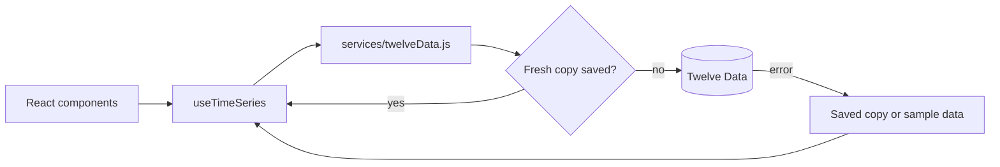

# 📈 Demo Bolsa

[](https://github.com/hrking31/Demo-Bolsa/actions/workflows/ci.yml)

[Español](README.md) | **English**

A demo of **integrating a financial REST API** ([Twelve Data](https://twelvedata.com/)): quotes and charts for four US stocks, with caching, rate-limit handling, error handling and **47 automated tests**.

🔗 **[See the live demo](https://demobolsa-31.web.app/)**


## 🔌 How the API is handled

The UI never calls the API directly. Everything goes through a service layer and a hook:



| Real-world problem | Solution | Where |
|---|---|---|
| The free plan allows 8 requests per minute | `localStorage` cache with expiry (1 h daily, 10 min intraday). The "1 month" view reuses data already downloaded | [`twelveData.js`](src/services/twelveData.js) |
| Two components request the same data at once | In-flight requests are shared: a single HTTP call | [`twelveData.js`](src/services/twelveData.js) |
| Twelve Data returns errors with **HTTP 200** | The body's `status` and `code` are checked, not just the HTTP status | [`twelveData.js`](src/services/twelveData.js) |
| Rate limit (429), invalid key (401/403), unknown symbol, no connection | Each case has its own translated message and a **Retry** button | [`twelveData.js`](src/services/twelveData.js), [`en.json`](src/i18n/en.json) |
| A slow response for the previous stock overwrites the current one | The hook drops responses that don't match the current symbol and interval | [`useTimeSeries.js`](src/hooks/useTimeSeries.js) |
| The API is down | The last saved copy or sample data is shown **with a visible label**: the demo never breaks | [`twelveData.js`](src/services/twelveData.js), [`sampleData.js`](src/services/sampleData.js) |
| The API key | Kept out of the repository (`.env.local`), plus security headers (CSP) on the host | [`.env.example`](.env.example), [`firebase.json`](firebase.json) |

On load, the app makes 5 requests: one daily series per stock and one intraday series.

## ✅ Tests

```bash
npm test
```

47 tests with **Vitest** and **Testing Library**. None of them call the real API: Twelve Data responses are mocked. **GitHub Actions** runs linting, tests and the build on every push ([`ci.yml`](.github/workflows/ci.yml)).

- **API layer:** request parameters, data order, cache and expiry, shared requests, every error code, unreadable responses, offline with and without a saved copy, blocked storage and no-key mode.
- **`useTimeSeries` hook:** a late response for another stock never replaces the current one; "Refresh" forces a new request without clearing what's on screen.
- **Utilities:** price and date formats (es/en), New York market hours (including daylight saving changes) and sample data.
- **Translations:** Spanish and English have the same keys and variables.

## ✨ Features

- Stock list with price, change and sparkline, plus a detailed 1-day (5-minute) or 1-month chart with tooltip and crosshair.
- New York market status (open or closed).
- Light and dark themes, starting from the system preference.
- Spanish and English with `i18next`, including error messages and date formats.
- No-scroll layout on phones, tablets, laptops and monitors.
- Accessible: keyboard navigation, visible focus and animations that respect "reduce motion".

## 🛠 Tech stack

React 19 · Vite · Tailwind CSS 4 · Chart.js · i18next · Vitest · Testing Library · GitHub Actions · Firebase Hosting

## 🚀 Running it locally

Requirements: Node.js 20 or later and a free [Twelve Data](https://twelvedata.com/) API key.

```bash
git clone https://github.com/hrking31/Demo-Bolsa.git
cd Demo-Bolsa
npm install
cp .env.example .env.local   # paste your key into .env.local
npm run dev                  # http://localhost:5173
```

Without a key, the app runs on sample data.

**Deployment:** `npm run build` and `firebase deploy`. The key ends up in the browser bundle, which is common for demos with free keys; in production, requests would go through a backend proxy that keeps it secret.

## 📁 Structure

```plaintext
src/
├── services/     # twelveData.js (API, cache, errors) and sampleData.js (fallback)
├── hooks/        # useTimeSeries (data loading) and useTheme
├── Components/   # StockCard, StockChart, Sparkline, theme, language and contact buttons
├── i18n/         # es.json, en.json and i18next setup
└── utils/        # formatting and market hours
```

## 👤 Author

**Hernando Rey** · [GitHub](https://github.com/hrking31) · [LinkedIn](https://www.linkedin.com/in/hernandorey/) · [hrking31@gmail.com](mailto:hrking31@gmail.com)
