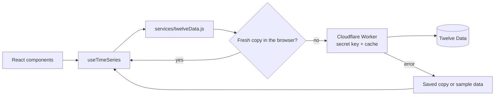

# 📈 Demo Bolsa

[](https://github.com/hrking31/Demo-Bolsa/actions/workflows/ci.yml)

[Español](README.md) | **English**

A demo of **integrating a financial REST API** ([Twelve Data](https://twelvedata.com/)): quotes and charts for four US stocks served through **my own Cloudflare Workers proxy** that keeps the API key secret, with caching, rate-limit handling, error handling and **66 automated tests**.

🔗 **[See the live demo](https://demobolsa-31.web.app/)**


## 🔌 How the API is handled

The UI never calls the API directly: requests go through a hook, a service layer and a proxy (Cloudflare Worker) that adds the key on the server.



| Real-world problem | Solution | Where |
|---|---|---|
| The API key must not reach the browser | A **Cloudflare Worker** stores it as a secret and adds it server-side. The published site contains no key | [`worker/src/index.js`](worker/src/index.js) |
| Someone could use the proxy for other requests | The Worker only answers the app's domains (CORS) and only the 4 symbols and 2 intervals the app uses | [`worker/src/index.js`](worker/src/index.js) |
| The free plan allows 8 requests per minute | Caching in the Worker and in `localStorage` with expiry (1 h daily, 5–10 min intraday). The "1 month" view reuses data already downloaded | [`index.js`](worker/src/index.js), [`twelveData.js`](src/services/twelveData.js) |
| Two components request the same data at once | In-flight requests are shared: a single HTTP call | [`twelveData.js`](src/services/twelveData.js) |
| Twelve Data returns errors with **HTTP 200** | The body's `status` and `code` are checked, not just the HTTP status. The Worker forwards only the code, never the original message | [`twelveData.js`](src/services/twelveData.js), [`index.js`](worker/src/index.js) |
| Rate limit (429), invalid key (401/403), unknown symbol, no connection | Each case has its own translated message and a **Retry** button | [`twelveData.js`](src/services/twelveData.js), [`en.json`](src/i18n/en.json) |
| A slow response for the previous stock overwrites the current one | The hook drops responses that don't match the current symbol and interval | [`useTimeSeries.js`](src/hooks/useTimeSeries.js) |
| The API is down | The last saved copy or sample data is shown **with a visible label**: the demo never breaks | [`twelveData.js`](src/services/twelveData.js), [`sampleData.js`](src/services/sampleData.js) |
| Browser-side attacks | Security headers on the host: the CSP only allows connections to the Worker | [`firebase.json`](firebase.json) |

On load, the app makes 5 requests: one daily series per stock and one intraday series.

## ✅ Tests

```bash
npm test
```

66 tests with **Vitest** and **Testing Library**. None of them call the real API: Twelve Data responses are mocked. **GitHub Actions** runs linting, tests and the build on every push ([`ci.yml`](.github/workflows/ci.yml)).

- **Proxy (Worker):** rejects other domains, symbols, intervals and methods; adds the key without ever returning it; caching and expiry; Twelve Data errors forwarded without the original message; Twelve Data down or returning unreadable responses.
- **API layer:** using the proxy without sending a key, request parameters, data order, cache and expiry, shared requests, every error code, offline with and without a saved copy, blocked storage and unconfigured mode.
- **`useTimeSeries` hook:** a late response for another stock never replaces the current one; "Refresh" forces a new request without clearing what's on screen.
- **Utilities:** price and date formats (es/en), New York market hours (including daylight saving changes) and sample data.
- **Translations:** Spanish and English have the same keys and variables.

## ✨ Features

- Stock list with price, change and sparkline, plus a detailed 1-day (5-minute) or 1-month chart with tooltip and crosshair.
- New York market status (open or closed).
- Light and dark themes, starting from the system preference.
- Spanish and English with `i18next`, including error messages and date formats.
- No-scroll layout on phones, tablets, laptops and monitors.
- Accessible: keyboard navigation, visible focus and animations that respect "reduce motion".

## 🛠 Tech stack

React 19 · Vite · Tailwind CSS 4 · Chart.js · i18next · Cloudflare Workers · Vitest · Testing Library · GitHub Actions · Firebase Hosting

## 🚀 Running it locally

Requirements: Node.js 20 or later.

```bash
git clone https://github.com/hrking31/Demo-Bolsa.git
cd Demo-Bolsa
npm install
npm run dev                  # http://localhost:5173
```

No setup needed: [`.env`](.env) already points to the published proxy, so the app shows real data. To use another Worker or call Twelve Data directly, create `.env.local` from [`.env.example`](.env.example); it takes precedence over `.env`:

- `VITE_API_PROXY_URL`: your own Worker's URL (the key stays in Cloudflare).
- `VITE_TWELVE_DATA_API_KEY`: a free [Twelve Data](https://twelvedata.com/) key to call the API directly (development only: it ends up in the browser).

With no configuration at all, the app runs on sample data.

### Proxy (Cloudflare Workers)

The code lives in [`worker/`](worker/). To publish it: create a Worker in the Cloudflare dashboard and paste `worker/src/index.js` (or run `npx wrangler deploy` inside `worker/`), then store the key as the **secret** `TWELVE_DATA_API_KEY` under *Settings → Variables and Secrets*. Allowed domains are listed in `ALLOWED_ORIGINS`.

### Deploying the app

`npm run build` and `firebase deploy --only hosting`. If the Worker URL changes, update `connect-src` in [`firebase.json`](firebase.json) as well.

## 📁 Structure

```plaintext
src/
├── services/     # twelveData.js (API, cache, errors) and sampleData.js (fallback)
├── hooks/        # useTimeSeries (data loading) and useTheme
├── Components/   # StockCard, StockChart, Sparkline, theme, language and contact buttons
├── i18n/         # es.json, en.json and i18next setup
└── utils/        # formatting and market hours
worker/
└── src/          # index.js (Cloudflare proxy) and its tests
```

---

<p align="center">
  <a href="https://hernandorey-31.web.app/en">
    <picture>
      <source media="(prefers-color-scheme: dark)" srcset="https://raw.githubusercontent.com/hrking31/hrking31/main/firma/firma-en-oscuro.svg">
      
    </picture>
  </a>
</p>

<p align="center">
  <a href="https://hernandorey-31.web.app/en"><picture><source media="(prefers-color-scheme: dark)" srcset="https://raw.githubusercontent.com/hrking31/hrking31/main/firma/boton-portfolio-oscuro.svg"></picture></a>
  <a href="https://www.linkedin.com/in/hernandorey/"><picture><source media="(prefers-color-scheme: dark)" srcset="https://raw.githubusercontent.com/hrking31/hrking31/main/firma/boton-linkedin-oscuro.svg"></picture></a>
  <a href="https://github.com/hrking31"><picture><source media="(prefers-color-scheme: dark)" srcset="https://raw.githubusercontent.com/hrking31/hrking31/main/firma/boton-github-oscuro.svg"></picture></a>
  <a href="mailto:hrking31@gmail.com"><picture><source media="(prefers-color-scheme: dark)" srcset="https://raw.githubusercontent.com/hrking31/hrking31/main/firma/boton-email-oscuro.svg"></picture></a>
</p>
