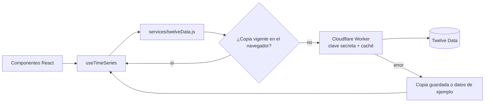

# 📈 Demo Bolsa

[](https://github.com/hrking31/Demo-Bolsa/actions/workflows/ci.yml)

**Español** | [English](README.en.md)

Demo de **integración con una API REST financiera** ([Twelve Data](https://twelvedata.com/)): cotizaciones y gráficos de cuatro acciones de EE. UU. a través de un **intermediario propio en Cloudflare Workers** que guarda la clave, con caché, control del límite de consultas, manejo de errores y **66 pruebas automatizadas**.

🔗 **[Ver la demo en vivo](https://demobolsa-31.web.app/)**


## 🔌 Cómo se maneja la API

La interfaz nunca llama a la API directamente: pasa por un hook, una capa de servicio y un intermediario (Cloudflare Worker) que agrega la clave en el servidor.



| Problema real | Cómo se resuelve | Dónde |
|---|---|---|
| La clave de API no puede viajar al navegador | Un **Cloudflare Worker** la guarda como secreto y la agrega en el servidor. La página publicada no contiene ninguna clave | [`worker/src/index.js`](worker/src/index.js) |
| Alguien podría usar el intermediario para otras consultas | El Worker solo responde a los dominios de la app (CORS) y solo a los 4 símbolos y 2 intervalos que usa la app | [`worker/src/index.js`](worker/src/index.js) |
| El plan gratuito permite 8 consultas por minuto | Caché en el Worker y en `localStorage` con vencimiento (1 h diario, 5–10 min intradía). La vista "1 mes" reutiliza datos ya descargados | [`index.js`](worker/src/index.js), [`twelveData.js`](src/services/twelveData.js) |
| Dos componentes piden lo mismo a la vez | Las solicitudes en curso se comparten: una sola llamada HTTP | [`twelveData.js`](src/services/twelveData.js) |
| Twelve Data responde los errores con **HTTP 200** | Se revisan `status` y `code` del cuerpo, no solo el código HTTP. El Worker reenvía solo el código, nunca el mensaje original | [`twelveData.js`](src/services/twelveData.js), [`index.js`](worker/src/index.js) |
| Límite alcanzado (429), clave inválida (401/403), símbolo inexistente, sin conexión | Cada caso tiene su mensaje, traducido, con botón **Reintentar** | [`twelveData.js`](src/services/twelveData.js), [`es.json`](src/i18n/es.json) |
| Una respuesta lenta de la acción anterior pisa a la actual | El hook descarta las respuestas que no corresponden al símbolo e intervalo vigentes | [`useTimeSeries.js`](src/hooks/useTimeSeries.js) |
| La API no responde | Se muestra la última copia guardada o datos de ejemplo **con una etiqueta visible**: la demo nunca queda rota | [`twelveData.js`](src/services/twelveData.js), [`sampleData.js`](src/services/sampleData.js) |
| Ataques en el navegador | Cabeceras de seguridad en el hosting: la CSP solo permite conectarse al Worker | [`firebase.json`](firebase.json) |

Al cargar, la app hace 5 consultas: una serie diaria por acción y una intradía.

## ✅ Pruebas

```bash
npm test
```

66 pruebas con **Vitest** y **Testing Library**. Ninguna llama a la API real: las respuestas de Twelve Data se simulan. **GitHub Actions** ejecuta la revisión de código, las pruebas y la compilación en cada push ([`ci.yml`](.github/workflows/ci.yml)).

- **Intermediario (Worker):** rechaza otros dominios, otros símbolos e intervalos y otros métodos; agrega la clave sin devolverla nunca; caché y vencimiento; errores de Twelve Data reenviados sin el mensaje original; Twelve Data caído o con respuesta ilegible.
- **Capa de API:** uso del intermediario sin enviar clave, parámetros de la consulta, orden de los datos, caché y vencimiento, solicitudes compartidas, cada código de error, sin conexión con y sin copia guardada, almacenamiento bloqueado y modo sin configurar.
- **Hook `useTimeSeries`:** una respuesta tardía de otra acción nunca reemplaza a la actual; "Actualizar" fuerza una consulta sin borrar lo visible.
- **Utilidades:** formatos de precio y fecha (es/en), horario del mercado de Nueva York (incluido el cambio de horario) y datos de ejemplo.
- **Traducciones:** español e inglés tienen las mismas claves y variables.

## ✨ Funcionalidades

- Lista de acciones con precio, variación y mini gráfico, y gráfico detallado de 1 día (cada 5 min) o 1 mes, con tooltip y línea guía.
- Estado del mercado de Nueva York (abierto o cerrado).
- Tema claro y oscuro, con la preferencia del sistema como inicio.
- Español e inglés con `i18next`, incluidos los mensajes de error y los formatos de fecha.
- Diseño sin scroll en celulares, tablets, laptops y monitores.
- Accesible: navegación por teclado, foco visible y animaciones que respetan "reducir movimiento".

## 🛠 Tecnologías

React 19 · Vite · Tailwind CSS 4 · Chart.js · i18next · Cloudflare Workers · Vitest · Testing Library · GitHub Actions · Firebase Hosting

## 🚀 Cómo ejecutarla

Requisitos: Node.js 20 o superior.

```bash
git clone https://github.com/hrking31/Demo-Bolsa.git
cd Demo-Bolsa
npm install
npm run dev                  # http://localhost:5173
```

No hace falta configurar nada: [`.env`](.env) ya apunta al intermediario publicado, así que la app muestra datos reales. Para usar otro Worker o llamar directo a Twelve Data, crea `.env.local` a partir de [`.env.example`](.env.example); tiene prioridad sobre `.env`:

- `VITE_API_PROXY_URL`: dirección de tu propio Worker (la clave queda en Cloudflare).
- `VITE_TWELVE_DATA_API_KEY`: clave gratuita de [Twelve Data](https://twelvedata.com/) para llamar directo (solo desarrollo: queda visible en el navegador).

Sin ninguna configuración, la app funciona con datos de ejemplo.

### Intermediario (Cloudflare Workers)

El código está en [`worker/`](worker/). Para publicarlo: crear un Worker en el panel de Cloudflare y pegar `worker/src/index.js` (o `npx wrangler deploy` dentro de `worker/`), y guardar la clave como **secreto** `TWELVE_DATA_API_KEY` en *Settings → Variables and Secrets*. Los dominios permitidos están en `ALLOWED_ORIGINS`.

### Despliegue de la app

`npm run build` y `firebase deploy --only hosting`. Si se cambia la dirección del Worker, actualizar también `connect-src` en [`firebase.json`](firebase.json).

## 📁 Estructura

```plaintext
src/
├── services/     # twelveData.js (API, caché, errores) y sampleData.js (respaldo)
├── hooks/        # useTimeSeries (carga de datos) y useTheme
├── Components/   # StockCard, StockChart, Sparkline, botones de tema, idioma y contacto
├── i18n/         # es.json, en.json y configuración de i18next
└── utils/        # formatos y horario del mercado
worker/
└── src/          # index.js (intermediario en Cloudflare) y sus pruebas
```

## 👤 Autor

**Hernando Rey** · [GitHub](https://github.com/hrking31) · [LinkedIn](https://www.linkedin.com/in/hernandorey/) · [hrking31@gmail.com](mailto:hrking31@gmail.com)
