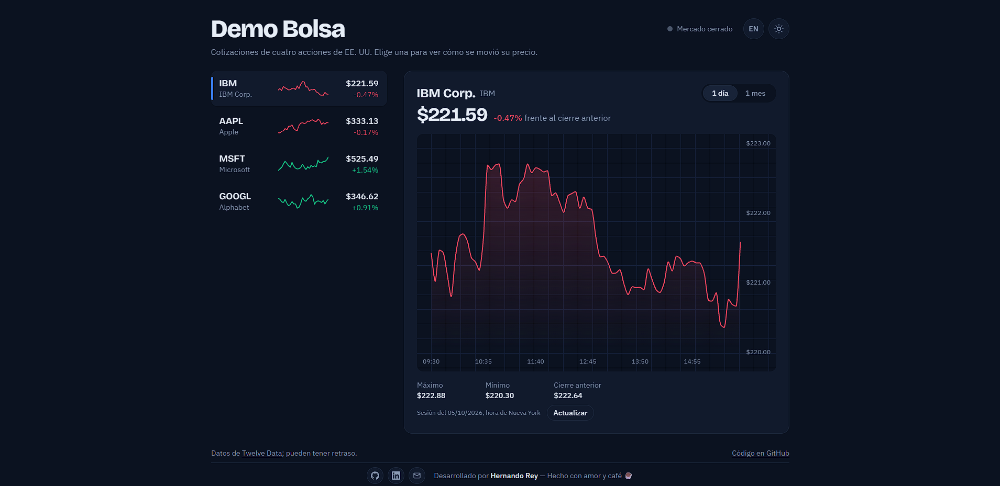
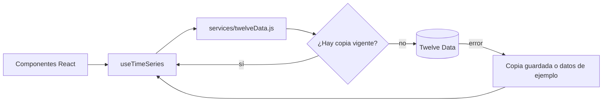

# 📈 Demo Bolsa

[](https://github.com/hrking31/Demo-Bolsa/actions/workflows/ci.yml)

**Español** | [English](README.en.md)

Demo de **integración con una API REST financiera** ([Twelve Data](https://twelvedata.com/)): cotizaciones y gráficos de cuatro acciones de EE. UU. con caché, control del límite de consultas, manejo de errores y **47 pruebas automatizadas**.

🔗 **[Ver la demo en vivo](https://demobolsa-31.web.app/)**



## 🔌 Cómo se maneja la API

La interfaz nunca llama a la API directamente. Todo pasa por una capa de servicio y un hook:



| Problema real | Cómo se resuelve | Dónde |
|---|---|---|
| El plan gratuito permite 8 consultas por minuto | Caché en `localStorage` con vencimiento (1 h diario, 10 min intradía). La vista "1 mes" reutiliza datos ya descargados | [`twelveData.js`](src/services/twelveData.js) |
| Dos componentes piden lo mismo a la vez | Las solicitudes en curso se comparten: una sola llamada HTTP | [`twelveData.js`](src/services/twelveData.js) |
| Twelve Data responde los errores con **HTTP 200** | Se revisan `status` y `code` del cuerpo, no solo el código HTTP | [`twelveData.js`](src/services/twelveData.js) |
| Límite alcanzado (429), clave inválida (401/403), símbolo inexistente, sin conexión | Cada caso tiene su mensaje, traducido, con botón **Reintentar** | [`twelveData.js`](src/services/twelveData.js), [`es.json`](src/i18n/es.json) |
| Una respuesta lenta de la acción anterior pisa a la actual | El hook descarta las respuestas que no corresponden al símbolo e intervalo vigentes | [`useTimeSeries.js`](src/hooks/useTimeSeries.js) |
| La API no responde | Se muestra la última copia guardada o datos de ejemplo **con una etiqueta visible**: la demo nunca queda rota | [`twelveData.js`](src/services/twelveData.js), [`sampleData.js`](src/services/sampleData.js) |
| La clave de API | Fuera del repositorio (`.env.local`) y cabeceras de seguridad (CSP) en el hosting | [`.env.example`](.env.example), [`firebase.json`](firebase.json) |

Al cargar, la app hace 5 consultas: una serie diaria por acción y una intradía.

## ✅ Pruebas

```bash
npm test
```

47 pruebas con **Vitest** y **Testing Library**. Ninguna llama a la API real: las respuestas de Twelve Data se simulan. **GitHub Actions** ejecuta la revisión de código, las pruebas y la compilación en cada push ([`ci.yml`](.github/workflows/ci.yml)).

- **Capa de API:** parámetros de la consulta, orden de los datos, caché y vencimiento, solicitudes compartidas, cada código de error, respuesta ilegible, sin conexión con y sin copia guardada, almacenamiento bloqueado y modo sin clave.
- **Hook `useTimeSeries`:** una respuesta tardía de otra acción nunca reemplaza a la actual; "Actualizar" fuerza una consulta sin borrar lo visible.
- **Utilidades:** formatos de precio y fecha (es/en), horario del mercado de Nueva York (incluido el cambio de horario) y datos de ejemplo.
- **Traducciones:** español e inglés tienen las mismas claves y variables.

## ✨ Funcionalidades

- Lista de acciones con precio, variación y mini gráfico, y gráfico detallado de 1 día (cada 5 min) o 1 mes, con tooltip y línea guía.
- Estado del mercado de Nueva York (abierto o cerrado).
- Tema claro y oscuro, con la preferencia del sistema como inicio.
- Español e inglés con `i18next`, incluidos los mensajes de error y los formatos de fecha.
- Diseño sin scroll en celulares, tablets, laptops y monitores.
- Accesible: navegación por teclado, foco visible y animaciones que respetan "reducir movimiento".

## 🛠 Tecnologías

React 19 · Vite · Tailwind CSS 4 · Chart.js · i18next · Vitest · Testing Library · GitHub Actions · Firebase Hosting

## 🚀 Cómo ejecutarla

Requisitos: Node.js 20 o superior y una clave gratuita de [Twelve Data](https://twelvedata.com/).

```bash
git clone https://github.com/hrking31/Demo-Bolsa.git
cd Demo-Bolsa
npm install
cp .env.example .env.local   # pega tu clave en .env.local
npm run dev                  # http://localhost:5173
```

Sin clave, la app funciona con datos de ejemplo.

**Despliegue:** `npm run build` y `firebase deploy`. La clave queda incluida en el código del navegador, algo habitual en demos con claves gratuitas; en producción las consultas pasarían por un servidor intermedio que la guarde.

## 📁 Estructura

```plaintext
src/
├── services/     # twelveData.js (API, caché, errores) y sampleData.js (respaldo)
├── hooks/        # useTimeSeries (carga de datos) y useTheme
├── Components/   # StockCard, StockChart, Sparkline, botones de tema, idioma y contacto
├── i18n/         # es.json, en.json y configuración de i18next
└── utils/        # formatos y horario del mercado
```

## 👤 Autor

**Hernando Rey** · [GitHub](https://github.com/hrking31) · [LinkedIn](https://www.linkedin.com/in/hernandorey/) · [hrking31@gmail.com](mailto:hrking31@gmail.com)
